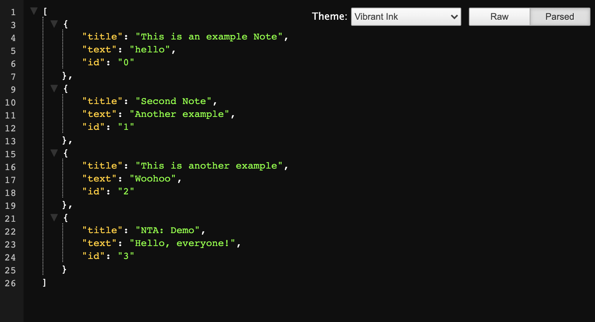

# Note-Taker Application

## Table of Contents
* [Description](#description)
* [Installation](#installation)
* [Technologies Used](#technologies-used)
* [Application Demo](#application-demo)
* [Contact Information](#contact-information)

## Description
This is an Express application which allows the busy user to create, save, and delete notes to help remember the important tasks of his/her day.

Upon opening this application for the first time, the user will be able to enter a note's title as well as its content. By clicking a disk icon in the upper right-hand corner of the screen, the user can save this note for later (as it will move to the sidebar on the left-hand side of the screen), keeping the note as long as desired, and begin writing another if need be. When the user returns, s/he will find the previous saved notes stored within the sidebar.

If the note is no longer needed, the user can click the small red trash icon on the right-most side of the saved note in order to permanentely delete the note, maintaining all the other notes that were previously saved.

## Installation
This application can be accessed and used through on Heroku at the following link: [Note Taker Application](https://vast-caverns-96839.herokuapp.com/)

## Technologies Used
HTML, CSS, JavaScript, Express

## Application Demo
On the homepage of the application, the user will see a welcome screen that invites a button-click to take the user to the page in which notes may be written. This page will be accessible with no additional path input (i.e., "/"), as well as any unrecognized path (e.g., "Jimmy Bob" or "cow").

When the user clicks the button, a note-page will appear allowing the user to enter his/her note's title and content area. The disk icon in the upper right-hand corner will allow this note to be saved for future reference. This path is reachable through the button, but also by the addition of "/notes" to the end of the existing URL.

Finally, for the purposes of developers, an additional pathway has been added to view all JSON input by the user with the path ending in "/api/notes" to the existing URL.

A full video of the application's functionality can be seen here:

[Full Application Demo Video]()

## Contact Information
* Jarrod Bataille
  * Portfolio Webpage: https://jtbataille.github.io/
  * GitHub Profile: https://github.com/jtbataille
  * E-mail Address: jtbataille@gmail.com

- - -
Copyright © 2007 Free Software Foundation, Inc. <https://fsf.org/>
